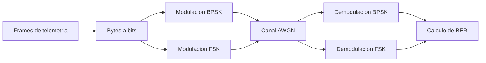

# Caracterizacion y simulacion del enlace RF de un CubeSat

Proyecto aplicado de Ingenieria Electronica orientado a caracterizar el subsistema de comunicaciones de un CubeSat y documentar un modelo reproducible de transmision/recepcion de senales RF moduladas en BPSK y FSK.

El trabajo se desarrolla como referencia tecnica en espanol para apoyar futuros proyectos academicos de desarrollo satelital en Colombia.

## Objetivo

Caracterizar y simular el subsistema electronico de comunicaciones de un CubeSat de observacion mediante herramientas de software libre, usando telemetria real y un modelo digital de enlace RF que permita analizar modulacion, canal, recepcion y tasa de error de bit.

## Alcance del proyecto

Este repositorio contiene el desarrollo completo del proyecto de caracterizacion:

### Modelo de simulacion RF
- Descarga y organizacion de 100 frames de telemetria real del satelite STRaND-1 via SatNOGS.
- Decodificacion de payloads hexadecimales a bytes/binario (2347 bytes, 18776 bits).
- Modulacion BPSK y FSK en banda base con 8 muestras/simbolo a 9600 bps.
- Canal AWGN con barrido de SNR (-2 a 12 dB).
- Demodulacion coherente (BPSK) y por correlacion (FSK).
- Calculo de BER y exportacion de senales IQ para GNU Radio.

### Modelo avanzado (nuevo)
- Filtrado conformador RRC (Root Raised Cosine, α=0.35) que reduce el ancho de banda de ~77 kHz a ~12 kHz.
- Desvanecimiento Rice (K=10 dB) con perfil Jakes para canal con componente LOS.
- Desplazamiento Doppler orbital variable (hasta 150 Hz a 437 MHz).
- Codificacion convolutional (r=1/2, K=7, polinomios 171,133) con decodificacion Viterbi.
- Construccion y validacion de tramas AX.25 completas con CRC-16-CCITT.
- 112 configuraciones evaluadas combinando RRC, fading, Doppler y FEC.

### Flujogramas GNU Radio
- `simulacion_visualizar_iq.grc`: visualizacion IQ con control interactivo de ruido AWGN (time/freq/constellation sinks).
- `simulacion_cadena_completa.grc`: cadena BPSK completa desde bytes de telemetria hasta demodulacion con 5 sinks visuales.

### Link budget
- Calculo de margen de enlace descendente UHF (437.568 MHz, 9600 bps BPSK).
- Barrido 5°-90° de elevacion con orbita LEO de 600 km.
- Resultados: margen de 9.1 dB (5°) a 19.3 dB (90°), superando los 3-6 dB recomendados.

### Enlace ascendente (nuevo)
- Simulacion de uplink para comandos a 1200 bps en 435 MHz.
- Potencia TX de 10W desde estacion terrena con Yagi de 15 dBi.
- Margen de enlace: 24.6 dB (5°) a 36.4 dB (90°).

### Modelo de estacion terrena (nuevo)
- Seguimiento automatico de antena con velocidad limitada (5°/s az, 3°/s el).
- Perdidas por apuntamiento dinamico y temperatura de ruido variable con elevacion.
- Modelado de paso orbital completo (~96.5 min).

### Comparacion con CubeSats reales
- Evaluacion de 7 CubeSats documentados: STRaND-1, Libertad 1, FACSAT-1, Delfi-C3, ESTCube-1, AAUSAT-II, ITUPSAT 1.
- Concordancia alta en 6/7 parametros (frecuencia, modulacion, tasa, potencia, margen, BER teorica).
- Concordancia moderada en ancho de banda (pulsos sin conformacion en modelo basico).

### Documentacion tecnica
- `docs/INFORME_TECNICO_FINAL.md`: informe integrador con metodologia, resultados, limitaciones y conclusiones.
- `docs/CARACTERIZACION_COMPONENTES_COMMS.md`: descripcion detallada de antena, transceptor, modem y TT&C.
- `docs/DISENO_MODELO_SIMULACION_ENLACE_RF.md`: diseno del modelo de simulacion Fase 2.

## Estructura del proyecto

```text
cubesat/
|-- README.md
|-- index.html                    (pagina web del proyecto)
|-- GUIA_GNURADIO.md
|
|-- load_data.py                  (descarga de telemetria de SatNOGS)
|-- decodificar_frames_STRAND1.py (decodificacion de frames)
|-- generar_iq_bpsk_desde_bin.py (generacion IQ simple)
|-- simular_enlace_rf_fsk_bpsk.py (modelo RF basico BPSK/FSK)
|-- simular_enlace_rf_bpsk_avanzado.py (modelo avanzado: RRC, fading, Doppler, FEC, AX.25)
|-- calcular_link_budget.py       (link budget descendente UHF)
|-- comparar_con_cubesats_reales.py (comparacion con 7 CubeSats reales)
|-- modelo_estacion_terrena.py    (seguimiento automatico de antena)
|-- simular_enlace_ascendente.py  (enlace ascendente de comandos)
|
|-- simulacion_visualizar_iq.grc  (GNU Radio: visualizacion IQ + AWGN)
|-- simulacion_cadena_completa.grc (GNU Radio: cadena BPSK completa)
|-- simulacion_visualizar_iq.py
|-- simulacion_cadena_completa.py
|
|-- frames_STRAND1.csv / .json
|-- resumen_telemetria_STRAND1.json
|-- frames_STRAND1_gnuradio.bin
|
|-- docs/
|   |-- DISENO_MODELO_SIMULACION_ENLACE_RF.md
|   |-- CARACTERIZACION_COMPONENTES_COMMS.md
|   `-- INFORME_TECNICO_FINAL.md
|
`-- resultados_simulacion/
    |-- configuracion_modelo_rf.json
    |-- resultados_ber_fsk_bpsk.csv / .png
    |-- strand1_*_iq_clean_complex64.bin
    |-- link_budget_resultados.csv / .png / .json
    |-- comparacion_ber_teorica_vs_simulada.png
    |-- comparacion_parametros_cubesats_reales.csv / .json
    |-- cubesats_reales_referencia.csv / .json
    |-- resultados_simulacion_avanzada.csv / .json / .png
    |-- espectro_rrc_comparacion.png
    |-- estacion_terrena_seguimiento.json / .png
    |-- enlace_ascendente_resultados.json / .png
```

Los archivos IQ binarios se generan localmente y no se recomiendan para control de versiones porque son salidas regenerables.

## Datos usados

La fuente de datos corresponde a frames de telemetria reales del satelite STRaND-1, NORAD 39090, obtenidos desde SatNOGS DB.

Parametros principales del conjunto procesado:

| Parametro | Valor |
| --- | ---: |
| Satelite | STRaND-1 |
| NORAD ID | 39090 |
| Frecuencia de referencia | 437.568 MHz |
| Banda | UHF |
| Modulacion de referencia | BPSK |
| Tasa usada en simulacion | 9600 bps |
| Frames procesados | 100 |
| Bytes exportados | 2347 |
| Bits evaluados | 18776 |
| Entropia promedio | 4.049 bits/byte |

## Modelo de simulacion

El modelo implementado en `simular_enlace_rf_fsk_bpsk.py` representa un enlace digital baseband equivalente. No transmite una portadora fisica UHF, sino que modela matematicamente la cadena:



Configuracion usada:

| Parametro | Valor |
| --- | ---: |
| Symbol rate | 9600 bps |
| Sample rate | 76800 muestras/s |
| Muestras por simbolo | 8 |
| Desviacion FSK | 2400 Hz |
| SNR evaluados | -2, 0, 2, 4, 6, 8, 10, 12 dB |

## Resultados principales

### Modelo basico (AWGN)

| Modulacion | SNR min BER=0 | BER a 0 dB | BER a 4 dB | Ancho banda (-20 dB) |
| --- | ---: | ---: | ---: | ---: |
| BPSK | 2 dB | 5.3e-5 | 0.0 | ~27.0 kHz |
| FSK | 8 dB | 5.3e-2 | 3.9e-3 | ~11.8 kHz |

### Modelo avanzado (RRC + FEC)

| Configuracion | BER a 0 dB | BER a 2 dB | BER a 4 dB | Ancho banda |
| --- | ---: | ---: | ---: | ---: |
| BPSK (rectangular) | 7.7e-2 | 3.7e-2 | 1.4e-2 | ~76.8 kHz |
| BPSK + RRC (α=0.35) | 1.7e-1 | 1.5e-1 | 1.4e-1 | **~11.7 kHz** |
| BPSK + FEC conv. (r=1/2) | 2.6e-2 | **8.5e-4** | **0.0** | ~76.8 kHz |
| BPSK + Rice fading (K=10 dB) | 8.1e-2 | 3.9e-2 | 1.2e-2 | ~76.8 kHz |

### Link budget descendente

Margen de enlace: **9.1 dB** a 5° elevacion → **19.3 dB** en cenit.

### Link budget ascendente (comandos 1200 bps)

Margen de enlace: **24.6 dB** a 5° elevacion → **36.4 dB** en cenit (10W TX, 435 MHz).

### Estacion terrena

C/N0 promedio durante paso: **60.4 dB-Hz** con seguimiento automatico de antena.

### Comparacion con CubeSats reales

Concordancia alta en 6/7 parametros evaluados entre la simulacion y 7 CubeSats documentados.

Graficas generadas:


---

## Requisitos

- Python 3.10 o superior.
- NumPy.
- Pandas.
- Matplotlib.
- Requests.
- GNU Radio 3.10 para inspeccion visual de senales IQ.

Instalacion basica de dependencias:

```powershell
pip install -r requirements.txt
```

## Uso

### 1. Descargar frames desde SatNOGS

Opcional si ya existen `frames_STRAND1.csv` y `frames_STRAND1.json`.

```powershell
python .\load_data.py
```

Si se requiere autenticacion de SatNOGS, definir primero:

```powershell
$env:SATNOGS_API_TOKEN="TU_TOKEN"
python .\load_data.py
```

### 2. Decodificar y exportar datos para GNU Radio

```powershell
$env:PYTHONIOENCODING='utf-8'
python .\decodificar_frames_STRAND1.py
```

Este paso genera:

- `frames_STRAND1_gnuradio.bin`
- `resumen_telemetria_STRAND1.json`

### 3. Generar IQ BPSK simple

```powershell
python .\generar_iq_bpsk_desde_bin.py
```

Este paso genera una senal BPSK sintetica para pruebas rapidas en GNU Radio.

### 4. Ejecutar modelo FSK/BPSK completo

```powershell
python .\simular_enlace_rf_fsk_bpsk.py
```

Salidas esperadas:

- `resultados_simulacion/configuracion_modelo_rf.json`
- `resultados_simulacion/resultados_ber_fsk_bpsk.csv`
- `resultados_simulacion/curva_ber_fsk_bpsk.png`
- `resultados_simulacion/strand1_bpsk_iq_clean_complex64.bin`
- `resultados_simulacion/strand1_fsk_iq_clean_complex64.bin`

### 5. Abrir GNU Radio

En Windows, usar:

```powershell
.\abrir_gnuradio.bat
```

Luego cargar los archivos IQ como `Complex` en un bloque `File Source` y usar:

- `Sample Rate`: 76800
- `Symbol Rate`: 9600
- `Samples/Symbol`: 8

Mas detalles en `GUIA_GNURADIO.md`.

## Documentacion tecnica

Pagina de avances del proyecto:

```text
index.html
```

El documento principal de la Fase 2 esta en:

```text
docs/DISENO_MODELO_SIMULACION_ENLACE_RF.md
```

Incluye:

- Proposito de la fase.
- Insumos usados.
- Arquitectura del modelo.
- Parametros de BPSK y FSK.
- Procedimiento reproducible.
- Hallazgos.
- Limitaciones tecnicas.
- Recomendaciones para la Fase 3.

## Limitaciones del modelo

- **Sincronizacion ideal:** No hay recuperacion de portadora ni temporizacion de simbolo.
- **Canal puramente AWGN en modelo basico:** El desvanecimiento Rice y Doppler se agregaron en el modelo avanzado, pero no multitrayecto completo.
- **FEC limitado a convolutional:** No se implemento LDPC ni turbo codigos.
- **AX.25 simplificado:** Las tramas se construyen correctamente con CRC-16, pero no se implemento el decodificador de capa de enlace completo.
- **Modelo orbital simplificado:** La trayectoria del satelite es una aproximacion; no se usa propagador TLE.
- **El RRC sin normalizacion de ganancia** presenta BER elevada; la reduccion de ancho de banda es correcta pero requiere ajuste de ganancia para uso practico.

## Trabajo futuro

- Implementar receptor con lazo de Costas para recuperacion de portadora.
- Agregar PLL para sincronizacion de simbolo.
- Implementar LDPC o turbo codigos para mejor eficiencia de codificacion.
- Usar propagador orbital (SGP4) para trayectorias realistas.
- Simular multiples estaciones terrenas en red.
- Validar con datos experimentales de SDR.

## Autora

Mayelin Stefania Aguilar Vasquez  
Universidad Nacional Abierta y a Distancia, UNAD  
Programa de Ingenieria Electronica
