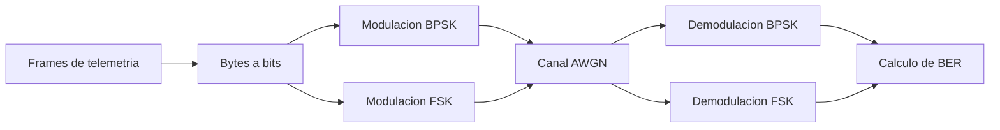

# Caracterizacion y simulacion del enlace RF de un CubeSat

Proyecto aplicado de Ingenieria Electronica orientado a caracterizar el subsistema de comunicaciones de un CubeSat y documentar un modelo reproducible de transmision/recepcion de senales RF moduladas en BPSK y FSK.

El trabajo se desarrolla como referencia tecnica en espanol para apoyar futuros proyectos academicos de desarrollo satelital en Colombia.

## Objetivo

Caracterizar y simular el subsistema electronico de comunicaciones de un CubeSat de observacion mediante herramientas de software libre, usando telemetria real y un modelo digital de enlace RF que permita analizar modulacion, canal, recepcion y tasa de error de bit.

## Alcance actual

Este repositorio contiene el avance de las primeras fases del proyecto:

- Descarga y organizacion de frames reales de telemetria del satelite STRaND-1.
- Caracterizacion basica de parametros de la senal y payload.
- Exportacion de datos para inspeccion en GNU Radio.
- Generacion de senales IQ sinteticas en BPSK.
- Diseno de un modelo de enlace RF en BPSK y FSK.
- Simulacion de canal AWGN con barrido de SNR.
- Calculo de BER para comparar el comportamiento de ambas modulaciones.
- Documentacion tecnica del procedimiento, hallazgos y limitaciones.

## Estructura del proyecto

```text
C:\CubeSat
|-- README.md
|-- load_data.py
|-- decodificar_frames_STRAND1.py
|-- generar_iq_bpsk_desde_bin.py
|-- simular_enlace_rf_fsk_bpsk.py
|-- GUIA_GNURADIO.md
|-- abrir_gnuradio.bat
|-- frames_STRAND1.csv
|-- frames_STRAND1.json
|-- resumen_telemetria_STRAND1.json
|-- docs/
|   `-- DISENO_MODELO_SIMULACION_ENLACE_RF.md
`-- resultados_simulacion/
    |-- configuracion_modelo_rf.json
    |-- resultados_ber_fsk_bpsk.csv
    `-- curva_ber_fsk_bpsk.png
```

Los archivos IQ binarios se generan localmente y no se recomiendan para control de versiones porque son salidas regenerables.

## Datos usados

La fuente de datos corresponde a frames de telemetria reales del satelite STRaND-1, NORAD 39090, obtenidos desde SatNOGS DB.

Parametros principales del conjunto procesado:

| Parametro | Valor |
| --- | ---: |
| Satelite | STRaND-1 |
| NORAD ID | 39090 |
| Frecuencia de referencia | 437.568 MHz |
| Banda | UHF |
| Modulacion de referencia | BPSK |
| Tasa usada en simulacion | 9600 bps |
| Frames procesados | 100 |
| Bytes exportados | 2347 |
| Bits evaluados | 18776 |
| Entropia promedio | 4.049 bits/byte |

## Modelo de simulacion

El modelo implementado en `simular_enlace_rf_fsk_bpsk.py` representa un enlace digital baseband equivalente. No transmite una portadora fisica UHF, sino que modela matematicamente la cadena:



Configuracion usada:

| Parametro | Valor |
| --- | ---: |
| Symbol rate | 9600 bps |
| Sample rate | 76800 muestras/s |
| Muestras por simbolo | 8 |
| Desviacion FSK | 2400 Hz |
| SNR evaluados | -2, 0, 2, 4, 6, 8, 10, 12 dB |

## Resultados principales

Resumen del barrido BER vs SNR:

| Modulacion | SNR minimo con BER 0 | BER a 0 dB | BER a 4 dB |
| --- | ---: | ---: | ---: |
| BPSK | 2 dB | 0.000053 | 0.000000 |
| FSK | 8 dB | 0.053259 | 0.003888 |

La simulacion muestra que, bajo el canal AWGN ideal implementado, BPSK presenta mejor desempeno frente al ruido que FSK para el conjunto de bits evaluado. FSK requiere mayor SNR para alcanzar BER igual a cero en esta corrida.

Grafica generada:


## Requisitos

- Python 3.10 o superior.
- NumPy.
- Pandas.
- Matplotlib.
- Requests.
- GNU Radio 3.10 para inspeccion visual de senales IQ.

Instalacion basica de dependencias:

```powershell
pip install numpy pandas matplotlib requests
```

## Uso

### 1. Descargar frames desde SatNOGS

Opcional si ya existen `frames_STRAND1.csv` y `frames_STRAND1.json`.

```powershell
python .\load_data.py
```

Si se requiere autenticacion de SatNOGS, definir primero:

```powershell
$env:SATNOGS_API_TOKEN="TU_TOKEN"
python .\load_data.py
```

### 2. Decodificar y exportar datos para GNU Radio

```powershell
$env:PYTHONIOENCODING='utf-8'
python .\decodificar_frames_STRAND1.py
```

Este paso genera:

- `frames_STRAND1_gnuradio.bin`
- `resumen_telemetria_STRAND1.json`

### 3. Generar IQ BPSK simple

```powershell
python .\generar_iq_bpsk_desde_bin.py
```

Este paso genera una senal BPSK sintetica para pruebas rapidas en GNU Radio.

### 4. Ejecutar modelo FSK/BPSK completo

```powershell
python .\simular_enlace_rf_fsk_bpsk.py
```

Salidas esperadas:

- `resultados_simulacion/configuracion_modelo_rf.json`
- `resultados_simulacion/resultados_ber_fsk_bpsk.csv`
- `resultados_simulacion/curva_ber_fsk_bpsk.png`
- `resultados_simulacion/strand1_bpsk_iq_clean_complex64.bin`
- `resultados_simulacion/strand1_fsk_iq_clean_complex64.bin`

### 5. Abrir GNU Radio

En Windows, usar:

```powershell
.\abrir_gnuradio.bat
```

Luego cargar los archivos IQ como `Complex` en un bloque `File Source` y usar:

- `Sample Rate`: 76800
- `Symbol Rate`: 9600
- `Samples/Symbol`: 8

Mas detalles en `GUIA_GNURADIO.md`.

## Documentacion tecnica

El documento principal de la Fase 2 esta en:

```text
docs/DISENO_MODELO_SIMULACION_ENLACE_RF.md
```

Incluye:

- Proposito de la fase.
- Insumos usados.
- Arquitectura del modelo.
- Parametros de BPSK y FSK.
- Procedimiento reproducible.
- Hallazgos.
- Limitaciones tecnicas.
- Recomendaciones para la Fase 3.

## Limitaciones actuales

El modelo actual es una aproximacion controlada para estudio academico. Todavia no incluye:

- Doppler orbital.
- Perdidas por espacio libre.
- Link budget completo.
- Ganancia real de antenas.
- Sensibilidad de receptor.
- Sincronizacion de portadora.
- Sincronizacion de reloj.
- Codificacion de canal.
- Tramas AX.25 completas.

Estas mejoras quedan planteadas para las siguientes fases del proyecto.

## Proximos pasos

- Agregar calculo de link budget para la frecuencia UHF de 437.568 MHz.
- Simular offset Doppler y errores de frecuencia.
- Documentar capturas de GNU Radio.
- Comparar resultados con otros CubeSats documentados.
- Integrar analisis de espectro y margen de enlace.
- Preparar el documento tecnico final del proyecto de grado.

## Autora

Mayelin Stefania Aguilar Vasquez  
Universidad Nacional Abierta y a Distancia, UNAD  
Programa de Ingenieria Electronica
