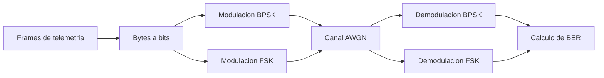
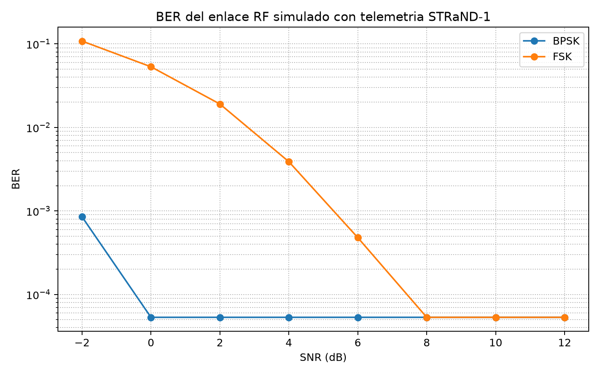
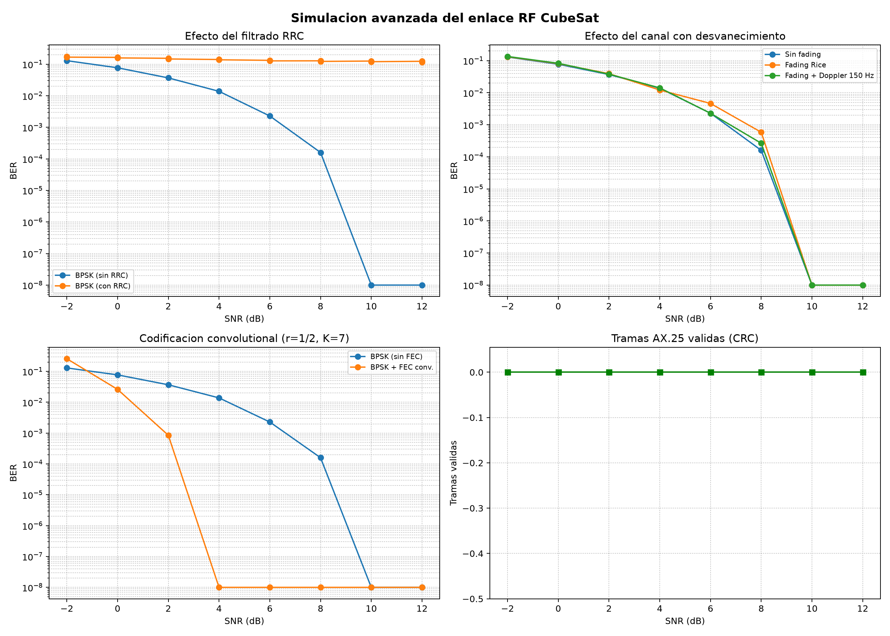
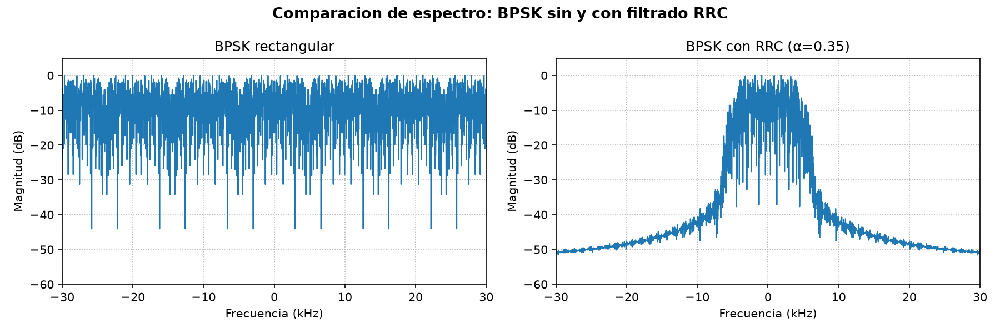
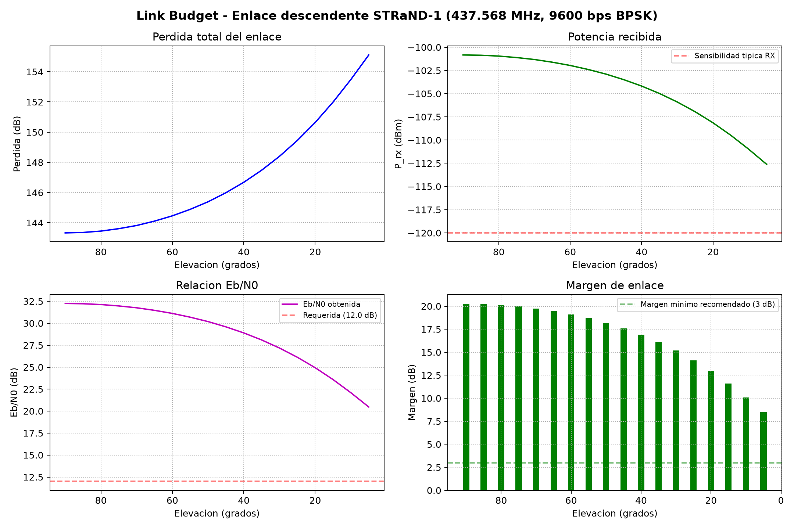

# Caracterizacion y simulacion del enlace RF de un CubeSat

Proyecto aplicado de Ingenieria Electronica orientado a caracterizar el subsistema de comunicaciones de un CubeSat y documentar un modelo reproducible de transmision/recepcion de senales RF moduladas en BPSK y FSK.

El trabajo se desarrolla como referencia tecnica en espanol para apoyar futuros proyectos academicos de desarrollo satelital en Colombia.

## Objetivo

Caracterizar y simular el subsistema electronico de comunicaciones de un CubeSat de observacion mediante herramientas de software libre, usando telemetria real y un modelo digital de enlace RF que permita analizar modulacion, canal, recepcion y tasa de error de bit.

## Objetivos especificos

1. Caracterizar los componentes de comunicaciones de STRaND-1 —antena, transceptor, modem y telemetria, seguimiento y comando (TT&C)— como caso de referencia para un CubeSat de observacion.
2. Obtener, conservar y procesar telemetria real de SatNOGS, pasando de tramas hexadecimales a bytes, campos decodificados y diagnosticos verificables del estado del satelite.
3. Implementar un modelo reproducible de enlace digital equivalente en banda base para comparar BPSK y FSK mediante BER, espectro y archivos IQ de apoyo para GNU Radio.
4. Evaluar mejoras y restricciones del enlace mediante conformado RRC, desvanecimiento Rice, Doppler residual, codificacion convolucional, verificacion AX.25, presupuesto de enlace y seguimiento de estacion terrena.
5. Validar la coherencia del modelo frente a parametros documentados de CubeSats reales y generar las tablas del informe directamente desde los resultados.
6. Presentar la telemetria y el gemelo digital con trazabilidad: distinguir los datos crudos de sus interpretaciones y explicitar la edad y las anomalías de cada lectura.

## Delimitacion del alcance

El proyecto es una caracterizacion y simulacion academica reproducible; no construye ni opera un satelite, ni repara fisicamente STRaND-1. El enlace RF se modela como un equivalente digital en banda base: no se sintetiza ni se recibe una portadora UHF real. La sincronizacion de portadora, simbolo y trama es ideal, y la validacion con capturas IQ de un SDR en un paso real queda como trabajo futuro. Por tanto, los resultados validan el modelo y sus decisiones de diseño dentro de esas condiciones, no certifican por si solos un receptor de vuelo.

## Trazabilidad y fuente de resultados

- El informe integrador vigente es `docs/INFORME_TECNICO_FINAL.md`; este README resume sus resultados y no debe contradecirlo.
- Los valores numericos se obtienen de los scripts y archivos de `resultados_simulacion/`; `generar_tablas_informe.py` actualiza las tablas marcadas del informe a partir de dichos archivos.
- El pipeline reproducible, en el orden indicado en la seccion **Uso**, es la fuente de verdad de cualquier resultado regenerado. Si cambia un parametro o un script, se deben regenerar los archivos de resultados y el informe antes de actualizar este resumen.
- La plataforma de telemetria conserva por separado los datos `RAW`, `PROCESSED`, `DECODED` y `UNKNOWN`; una magnitud fisica solo se publica cuando su protocolo y su conversion estan validados.

## Alcance del proyecto

Este repositorio contiene el desarrollo completo del proyecto de caracterizacion:

### Modelo de simulacion RF
- Descarga y organizacion de telemetria real del satelite STRaND-1 via SatNOGS: 36641 frames,
  combinando el archivo historico de SatNOGS DB (2016-2022) con las observaciones de SatNOGS
  Network (2022-2026), con la ventana de la transicion de 2020-2021 descargada dia a dia.
- Decodificacion de payloads hexadecimales a bytes/binario (2347 bytes, 18776 bits).
- Modulacion BPSK y FSK en banda base con 8 muestras/simbolo a 9600 bps.
- Canal AWGN con barrido de SNR (-2 a 12 dB).
- Demodulacion coherente (BPSK) y por correlacion (FSK).
- Calculo de BER y exportacion de senales IQ para GNU Radio.

### Modelo avanzado
- Filtrado conformador RRC (Root Raised Cosine, α=0.35): reduce el ancho de banda ocupado al 99 % de ~66 kHz a ~11 kHz **sin coste en BER**, acercandose al limite teorico R(1+α)=12.96 kHz.
- Desvanecimiento Rice (K=10 dB) con perfil Jakes para canal con componente LOS.
- Sensibilidad al error residual de Doppler tras la pre-compensacion por TLE (0 a 0.2 Hz).
- Codificacion convolutional (r=1/2, K=7, polinomios 171,133) con decodificacion Viterbi: ~4 dB de ganancia de codificacion, con el umbral caracteristico por debajo de -8 dB.
- Construccion y verificacion de tramas AX.25 2.2 con FCS CRC-16/X-25 real.
- 18 configuraciones x 8 puntos de SNR = 144 corridas.

### Flujogramas GNU Radio
- `simulacion_visualizar_iq.grc`: visualizacion IQ con control interactivo de ruido AWGN (time/freq/constellation sinks).
- `simulacion_cadena_completa.grc`: cadena BPSK completa desde bytes de telemetria hasta demodulacion con 5 sinks visuales.

### Gemelo digital
- Reconstruccion del estado del satelite por ultimo valor conocido, con la **edad** de cada lectura a la vista.
- Reproduccion temporal sobre eje comprimido: 2250 dias de archivo en 46,1 h, con 588 pases identificados.
- Deteccion de anomalias con z-score robusto (mediana + MAD) y regla de canal enrielado.
- Modelo 3D del CubeSat en React Three Fiber, gobernado por los datos: ningun elemento se mueve sin una lectura que lo mueva.
- Fecha por si solo el fallo de la instrumentacion de energia el 2021-02-24, con un salto de +2,57 V sobre una linea base de 7,18 V.

### Link budget
- Calculo de margen de enlace descendente UHF (437.568 MHz, 9600 bps BPSK).
- Barrido 5°-90° de elevacion con orbita LEO de 775 km (altura real de STRaND-1 segun TLE).
- Temperatura de sistema referida a la entrada del receptor, incluyendo el ruido del cable de antena.
- Resultados: margen de 7.1 dB (5°) a 18.0 dB (90°), superando los 3-6 dB recomendados.

### Enlace ascendente
- Simulacion de uplink para comandos a 1200 bps en 435 MHz.
- Potencia TX de 10W desde estacion terrena con Yagi de 15 dBi.
- Margen de enlace: 23.3 dB (5°) a 34.2 dB (90°).
- Tasa maxima sostenible con la Eb/N0 requerida: 253 kbps (5°) a 3.1 Mbps (cenit).

### Modelo de estacion terrena
- Paso orbital completo sobre traza de circulo maximo: 15.0 min de horizonte a horizonte, 12.4 min utiles sobre 5°.
- Seguimiento automatico de antena con velocidad limitada (5°/s az, 3°/s el).
- Error de apuntamiento calculado fuera de boresight y perdida acotada al nivel de lobulo lateral.
- Resultado vigente: aunque la demanda instantanea de azimut alcanza 8.23 °/s frente a los 5 °/s del rotor, el seguimiento preposicionado produce un error maximo de 0.77° y una perdida maxima de 0.01 dB en la simulacion.

### Comparacion con CubeSats reales
- Evaluacion de 7 CubeSats documentados: STRaND-1, Libertad 1, FACSAT-1, Delfi-C3, ESTCube-1, AAUSAT-II, ITUPSAT 1.
- Concordancia alta en los 7 parametros evaluados (frecuencia, modulacion, tasa, potencia, margen, BER teorica y ancho de banda con conformado RRC).
- La tabla comparativa se construye leyendo los CSV de resultados, no con valores transcritos.

### Documentacion tecnica
- `docs/INFORME_TECNICO_FINAL.md`: informe integrador con metodologia, resultados, limitaciones y conclusiones.
- `docs/CARACTERIZACION_COMPONENTES_COMMS.md`: descripcion detallada de antena, transceptor, modem y TT&C.
- `docs/DISENO_MODELO_SIMULACION_ENLACE_RF.md`: diseno del modelo de simulacion Fase 2.
- `docs/ANALISIS_TELEMETRIA_SALUD_CUBESAT.md`: cadena completa senal RF -> estado del satelite,
  con procesamiento de senal, sincronizacion, estructura de paquetes, monitoreo de salud,
  indicadores de desempeno y comparacion de protocolos.

## Estructura del proyecto

```text
cubesat/
|-- README.md
|-- index.html                    (pagina web del proyecto)
|-- GUIA_GNURADIO.md
|
|-- geometria_orbital.py          (geometria orbital y ruido: modulo comun)
|-- load_data.py                  (descarga de telemetria de SatNOGS)
|-- decodificar_frames_STRAND1.py (decodificacion de frames)
|-- generar_iq_bpsk_desde_bin.py (generacion IQ simple)
|-- simular_enlace_rf_fsk_bpsk.py (modelo RF basico BPSK/FSK)
|-- simular_enlace_rf_bpsk_avanzado.py (modelo avanzado: RRC, fading, Doppler, FEC, AX.25)
|-- calcular_link_budget.py       (link budget descendente UHF)
|-- comparar_con_cubesats_reales.py (comparacion con 7 CubeSats reales)
|-- modelo_estacion_terrena.py    (seguimiento automatico de antena)
|-- simular_enlace_ascendente.py  (enlace ascendente de comandos)
|-- analizar_entropia.py          (entropia de las tramas contra el techo log2(n))
|-- generar_tablas_informe.py     (regenera las tablas del informe desde los datos)
|
|-- gemelo_digital/               (motor del gemelo digital, seccion 11 del informe)
|   |-- datos.py                  (carga desde PostgreSQL a DataFrames)
|   |-- analisis_estructura.py    (inventario de columnas y veredicto por magnitud)
|   |-- estado.py                 (reconstruccion por ultimo valor conocido, con edad)
|   |-- reproduccion.py           (reproduccion temporal sobre eje comprimido)
|   |-- anomalias.py              (z-score robusto y regla de canal enrielado)
|   `-- demo_pico.py              (demostracion del fallo de febrero de 2021)
|
|-- simulacion_visualizar_iq.grc  (GNU Radio: visualizacion IQ + AWGN)
|-- simulacion_cadena_completa.grc (GNU Radio: cadena BPSK completa)
|-- simulacion_visualizar_iq.py
|-- simulacion_cadena_completa.py
|
|-- frames_STRAND1.csv / .json
|-- resumen_telemetria_STRAND1.json
|-- frames_STRAND1_gnuradio.bin
|
|-- docs/
|   |-- DISENO_MODELO_SIMULACION_ENLACE_RF.md
|   |-- CARACTERIZACION_COMPONENTES_COMMS.md
|   |-- ANALISIS_TELEMETRIA_SALUD_CUBESAT.md
|   `-- INFORME_TECNICO_FINAL.md
|
|-- telemetria_strand1/           (plataforma web de telemetria: FastAPI + React + PostgreSQL)
|   |-- backend/app/              (ingesta, decodificador AMSAT-UK, API)
|   |-- frontend/src/             (interfaz de consulta)
|   |-- tools/                    (descarga del historico y analisis de series por canal)
|   `-- telemetria_*.csv          (exportaciones de tramas, parciales)
|
`-- resultados_simulacion/
    |-- configuracion_modelo_rf.json
    |-- resultados_ber_fsk_bpsk.csv / .png
    |-- strand1_*_iq_clean_complex64.bin
    |-- link_budget_resultados.csv / .png / .json
    |-- comparacion_ber_teorica_vs_simulada.png
    |-- comparacion_parametros_cubesats_reales.csv / .json
    |-- cubesats_reales_referencia.csv / .json
    |-- resultados_simulacion_avanzada.csv / .json / .png
    |-- espectro_rrc_comparacion.png
    |-- estacion_terrena_seguimiento.json / .png
    |-- enlace_ascendente_resultados.json / .png
```

Los archivos IQ binarios se generan localmente y no se recomiendan para control de versiones porque son salidas regenerables.

## Datos usados

La fuente de datos corresponde a frames de telemetria reales del satelite STRaND-1, NORAD 39090, obtenidos desde SatNOGS DB.

Parametros principales del conjunto procesado:

| Parametro | Valor |
| --- | ---: |
| Satelite | STRaND-1 |
| NORAD ID | 39090 |
| Frecuencia de referencia | 437.568 MHz |
| Banda | UHF |
| Modulacion de referencia | BPSK |
| Tasa usada en simulacion | 9600 bps |
| Frames procesados (conjunto base, SatNOGS DB) | 100 |
| Bytes exportados | 2347 |
| Bits evaluados | 18776 |
| Entropia promedio | 4.049 bits/byte |

Conjunto ampliado desde las observaciones de SatNOGS Network (ver seccion 3 del informe
tecnico), a 28-07-2026:

| Parametro | Valor |
|---|---|
| Frames | 36641 |
| Bytes totales | 517878 |
| Entropia promedio | 3.066 bits/byte (maximo posible 3.639 para estas longitudes) |
| Balizas de STRaND-1 reconocidas | 32754 |
| Campos decodificados | 53, de los cuales 42 varian |
| Rango temporal | 2022-11-16 a 2026-07-13 |

Separacion por estado de la observacion (criterio de SatNOGS, independiente del
analisis de bytes de este trabajo):

| Estado | Observaciones | Frames | Balizas | % balizas |
|---|---|---|---|---|
| good | 488 | 6225 | 5929 | 95.2% |
| bad | 1873 | 2415 | 6 | 0.2% |

## Modelo de simulacion

El modelo implementado en `simular_enlace_rf_fsk_bpsk.py` representa un enlace digital baseband equivalente. No transmite una portadora fisica UHF, sino que modela matematicamente la cadena:



Configuracion usada:

| Parametro | Valor |
| --- | ---: |
| Symbol rate | 9600 bps |
| Sample rate | 76800 muestras/s |
| Muestras por simbolo | 8 |
| Desviacion FSK | 2400 Hz |
| SNR evaluados | -2, 0, 2, 4, 6, 8, 10, 12 dB |

## Resultados principales

### Modelo basico (AWGN)

| Modulacion | SNR min BER=0 | BER a 0 dB | BER a 4 dB | Ancho banda (-20 dB) |
| --- | ---: | ---: | ---: | ---: |
| BPSK | 2 dB | 5.3e-5 | 0.0 | ~27.0 kHz |
| FSK | 8 dB | 5.3e-2 | 3.9e-3 | ~11.8 kHz |

### Modelo avanzado (RRC + fading + FEC)

El barrido de SNR de este modelo (-10 a 4 dB) es mas bajo que el del modelo basico porque con el conformado de pulso correcto el enlace deja de cometer errores a partir de 0 dB.

| Configuracion | BER a -8 dB | BER a -6 dB | BER a -4 dB | Ancho banda (99 %) |
| --- | ---: | ---: | ---: | ---: |
| BPSK rectangular (NRZ) | 5.3e-2 | 2.4e-2 | 6.0e-3 | ~66.1 kHz |
| BPSK + RRC (α=0.35) | 5.7e-2 | 2.3e-2 | 6.6e-3 | **~11.2 kHz** |
| BPSK + Rice fading (K=10 dB) | 6.8e-2 | 2.9e-2 | 1.1e-2 | ~66.1 kHz |
| BPSK + FEC conv. (r=1/2) | **3.8e-3** | **2.1e-4** | **0.0** | ~66.0 kHz |

Sensibilidad al residual de Doppler tras la pre-compensacion, sobre un registro de 1.96 s sin recuperacion de portadora:

| Residual | BER a -4 dB | BER a 0 dB | BER a 4 dB |
| --- | ---: | ---: | ---: |
| 0 Hz | 6.0e-3 | 0.0 | 0.0 |
| 0.05 Hz | 1.0e-2 | 2.7e-4 | 0.0 |
| 0.1 Hz | 4.3e-2 | 9.1e-3 | 5.9e-4 |
| 0.2 Hz | 3.7e-1 | 3.6e-1 | 3.6e-1 |

Tramas AX.25 validadas por FCS: 0 tramas a -6 dB, 15 a -2 dB, las 37 a partir de 0 dB.

### Gemelo digital

21833 eventos y 588 pases reconstruidos; 2250 dias de archivo comprimidos en 46,1 h de eje virtual.
El detector fecha el fallo de la instrumentacion de energia el **2021-02-24 11:14:57**, con la
desviacion tipica cayendo de 1,618 a 0,002 V: el valor **sube** a 9,7488 V, asi que ninguna alarma
por bateria baja se disparara nunca.

### Link budget descendente

Margen de enlace: **7.1 dB** a 5° elevacion → **18.0 dB** en cenit.

### Link budget ascendente (comandos 1200 bps)

Margen de enlace: **23.3 dB** a 5° elevacion → **34.2 dB** en cenit (10W TX, 435 MHz).

### Estacion terrena

El modelo vigente produce un paso de 15.0 min horizonte a horizonte, con 12.4 min utiles sobre 5° y culminacion a 85°. El C/N0 promedio es **66.8 dB-Hz** (60.9 a 72.6 dB-Hz); el error maximo de apuntamiento es 0.77° y la perdida maxima es 0.01 dB. Estos valores proceden de `modelo_estacion_terrena.py` y su salida `resultados_simulacion/estacion_terrena_seguimiento.json`.

### Comparacion con CubeSats reales

Concordancia alta en los 7 parametros evaluados entre la simulacion y 7 CubeSats documentados.

Graficas generadas:






---

## Requisitos

- Python 3.10 o superior.
- NumPy.
- Pandas.
- Matplotlib.
- Requests.
- GNU Radio 3.10 para inspeccion visual de senales IQ.

Instalacion basica de dependencias:

```bash
pip install -r requirements.txt
```

## Uso

Cada script es independiente y escribe sus salidas en `resultados_simulacion/`. El pipeline completo, en orden:

```bash
python load_data.py                      # 1. Descarga telemetria de SatNOGS
python decodificar_frames_STRAND1.py     # 2. Decodifica a bytes -> frames_STRAND1_gnuradio.bin
python generar_iq_bpsk_desde_bin.py      # 3. IQ BPSK sintetica para pruebas en GNU Radio
python simular_enlace_rf_fsk_bpsk.py     # 4. Modelo basico BPSK/FSK + BER
python simular_enlace_rf_bpsk_avanzado.py # 5. Modelo avanzado (tarda unos minutos por el Viterbi)
python calcular_link_budget.py           # 6. Link budget descendente
python simular_enlace_ascendente.py      # 7. Link budget ascendente
python modelo_estacion_terrena.py        # 8. Paso orbital con seguimiento
python comparar_con_cubesats_reales.py   # 9. Comparacion con 7 CubeSats
python generar_tablas_informe.py         # 10. Regenera las tablas del informe tecnico
```

El paso 1 es opcional si ya existen `frames_STRAND1.csv` y `frames_STRAND1.json`. Si SatNOGS pide autenticacion:

```bash
export SATNOGS_API_TOKEN="TU_TOKEN"   # en PowerShell: $env:SATNOGS_API_TOKEN="TU_TOKEN"
python load_data.py
```

Los pasos 6 a 8 importan `geometria_orbital.py`, asi que deben ejecutarse desde el directorio del proyecto. El paso 10 debe correrse siempre que se cambie cualquier modelo: reescribe las tablas de `docs/INFORME_TECNICO_FINAL.md` a partir de los archivos de resultados.

### Abrir GNU Radio

En Windows, usar:

```powershell
.\abrir_gnuradio.bat
```

Luego cargar los archivos IQ como `Complex` en un bloque `File Source` y usar:

- `Sample Rate`: 76800
- `Symbol Rate`: 9600
- `Samples/Symbol`: 8

Mas detalles en `GUIA_GNURADIO.md`.

## Documentacion tecnica

Pagina de avances del proyecto:

```text
index.html
```

El documento principal de la Fase 2 esta en:

```text
docs/DISENO_MODELO_SIMULACION_ENLACE_RF.md
```

Incluye:

- Proposito de la fase.
- Insumos usados.
- Arquitectura del modelo.
- Parametros de BPSK y FSK.
- Procedimiento reproducible.
- Hallazgos.
- Limitaciones tecnicas.
- Recomendaciones para la Fase 3.

## Limitaciones del modelo

- **Sincronizacion ideal:** No hay recuperacion de portadora ni temporizacion de simbolo. Es la limitacion de mayor impacto: la tabla de Doppler residual muestra que basta un error de 0.2 Hz para producir un piso de error irreducible.
- **Sincronizacion de trama ideal:** El verificador AX.25 calcula el FCS real sobre los bytes recibidos, pero localiza las tramas por desplazamiento conocido; no hay busqueda de banderas ni bit stuffing.
- **Canal sin multitrayecto completo:** Se modelan Rice y Doppler, pero no reflexiones multiples ni rotacion de Faraday.
- **FEC limitado a convolutional con decision dura:** No se implemento LDPC, turbo codigos ni decision blanda en el Viterbi.
- **Modelo orbital simplificado:** Orbita circular y Tierra esferica; no se usa propagador SGP4 con TLE reales.
- **FSK con tonos no ortogonales** para el detector de energia empleado (Δf·T = 0.5), lo que penaliza su curva frente a la teorica.
- **Amplificador ideal:** No se modelan compresion AM-AM, AM-PM ni distorsion armonica del PA.

## Trabajo futuro

- Implementar receptor con lazo de Costas para recuperacion de portadora y cuantificar la mejora en tolerancia al Doppler residual.
- Agregar sincronizacion de simbolo (Gardner o Mueller-Muller).
- Incorporar decision blanda en el Viterbi (~2 dB adicionales) y evaluar LDPC.
- Implementar el decodificador AX.25 completo con busqueda de banderas y bit stuffing.
- Usar propagador orbital (SGP4) con TLE reales de STRaND-1.
- Validar con capturas IQ reales de un SDR sobre un paso del satelite.

## Autora

Mayelin Stefania Aguilar Vasquez  
Universidad Nacional Abierta y a Distancia, UNAD  
Programa de Ingenieria Electronica
