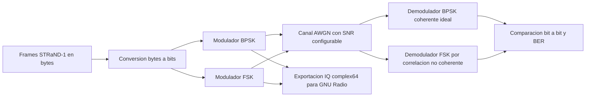

# Diseño del modelo de simulacion del enlace de comunicacion RF CubeSat

Proyecto: Caracterizacion del subsistema electronico de comunicaciones de un CubeSat mediante simulacion de senales de radiofrecuencia.

Autora: Mayelin Stefania Aguilar Vasquez.

Fecha de elaboracion: 2026-05-21.

## 1. Proposito de la fase

De acuerdo con la Fase 2 de la propuesta, esta etapa cubre la instalacion/configuracion del entorno de simulacion y el diseño del modelo del enlace de comunicacion para transmision y recepcion de una señal RF modulada en FSK/BPSK.

El alcance implementado es un modelo digital baseband equivalente. Esto significa que no se transmite una portadora fisica en UHF, sino que se representa matematicamente la señal modulada, el canal y la recuperacion de bits. Este enfoque es adecuado para validar flujo de señal, sensibilidad al ruido, BER y preparacion de archivos IQ para GNU Radio.

## 2. Insumos usados del proyecto

Se trabajó con telemetria real del satelite STRaND-1, NORAD 39090, descargada desde SatNOGS y procesada en el workspace del proyecto.

Archivos base:

- `frames_STRAND1.csv`: frames de telemetria en hexadecimal.
- `frames_STRAND1_gnuradio.bin`: bytes de telemetria concatenados para simulacion.
- `resumen_telemetria_STRAND1.json`: resumen tecnico de los frames procesados.
- `simular_enlace_rf_fsk_bpsk.py`: modelo reproducible del enlace BPSK/FSK.
- `resultados_simulacion/resultados_ber_fsk_bpsk.csv`: tabla de BER por SNR.
- `resultados_simulacion/curva_ber_fsk_bpsk.png`: grafica comparativa BER vs SNR.

Parametros caracterizados desde los datos:

| Parametro | Valor |
| --- | ---: |
| Satelite de referencia | STRaND-1 |
| NORAD ID | 39090 |
| Frecuencia documentada | 437.568 MHz |
| Banda | UHF |
| Modulacion de referencia del caso real | BPSK |
| Tasa de simbolos usada | 9600 bps |
| Frames procesados | 100 |
| Bytes totales exportados | 2347 bytes |
| Bits evaluados | 18776 bits |
| Longitud promedio de frame | 23.5 bytes |
| Rango temporal de datos | 2025-04-24 a 2026-05-06 |
| Entropia promedio de payload | 4.049 bits/byte |

## 3. Arquitectura del modelo

El modelo se divide en cinco bloques funcionales:



### 3.1 Fuente de datos

La fuente es `frames_STRAND1_gnuradio.bin`, generado a partir de los payloads hexadecimales del CSV. El archivo contiene bytes de telemetria concatenados; no es una captura SDR real. Por ello, el primer paso del modelo es transformar bytes a bits mediante `numpy.unpackbits`.

### 3.2 Modulacion BPSK

La BPSK se modela en banda base con mapeo NRZ:

- bit `0` -> simbolo `-1`
- bit `1` -> simbolo `+1`

Cada simbolo se sobremuestrea a 8 muestras/simbolo. La componente I contiene la señal y la componente Q se conserva en cero para la señal limpia.

### 3.3 Modulacion FSK

La FSK binaria se modela mediante dos tonos complejos:

- bit `0` -> frecuencia instantanea `-2400 Hz`
- bit `1` -> frecuencia instantanea `+2400 Hz`

La frecuencia de muestreo es 76800 muestras/s, equivalente a 8 muestras por simbolo para una tasa de 9600 bps.

### 3.4 Canal

El canal se representa como AWGN, es decir, ruido blanco gaussiano aditivo. Se evaluaron los siguientes niveles:

`-2, 0, 2, 4, 6, 8, 10 y 12 dB`

Este canal permite observar el deterioro progresivo de la recuperacion de bits. No incluye todavia desvanecimiento, Doppler, perdida por trayectoria, desalineacion de antena ni no linealidades del transmisor.

### 3.5 Recepcion y decision

Para BPSK se usa una recepcion coherente ideal: se promedian las muestras de cada simbolo y se decide `1` si el promedio de la componente I es mayor o igual a cero.

Para FSK se usa comparacion de energia por correlacion: cada simbolo recibido se compara contra el tono positivo y el tono negativo; el tono con mayor energia determina el bit recuperado.

## 4. Procedimiento reproducible

Desde `C:\CubeSat`, ejecutar:

```powershell
$env:PYTHONIOENCODING='utf-8'
python .\decodificar_frames_STRAND1.py
python .\simular_enlace_rf_fsk_bpsk.py
```

El primer comando genera o actualiza `frames_STRAND1_gnuradio.bin`. El segundo comando ejecuta el modelo FSK/BPSK y produce:

- `resultados_simulacion/configuracion_modelo_rf.json`
- `resultados_simulacion/resultados_ber_fsk_bpsk.csv`
- `resultados_simulacion/curva_ber_fsk_bpsk.png`
- `resultados_simulacion/strand1_bpsk_iq_clean_complex64.bin`
- `resultados_simulacion/strand1_fsk_iq_clean_complex64.bin`

Para inspeccion en GNU Radio:

1. Abrir `C:\CubeSat\abrir_gnuradio.bat`.
2. Agregar un bloque `File Source` con salida `Complex`.
3. Cargar `strand1_bpsk_iq_clean_complex64.bin` o `strand1_fsk_iq_clean_complex64.bin`.
4. Configurar `Sample Rate = 76800`.
5. Visualizar con `QT GUI Time Sink`, `QT GUI Frequency Sink` o bloques de constelacion/demodulacion.

## 5. Resultados obtenidos

Tabla resumida:

| Modulacion | SNR minimo con BER = 0 en esta corrida | BER a 0 dB | BER a 4 dB | Ancho de banda estimado a -20 dB |
| --- | ---: | ---: | ---: | ---: |
| BPSK | 2 dB | 0.000053 | 0.000000 | 27022.75 Hz |
| FSK | 8 dB | 0.053259 | 0.003888 | 11775.54 Hz |

Hallazgos:

- La cadena BPSK fue mas robusta en el modelo ideal usado: con 18776 bits evaluados, presento 1 error a 0 dB y 0 errores desde 2 dB.
- La cadena FSK mostro mayor sensibilidad al ruido: a -2 dB produjo BER de 0.10817 y a 6 dB bajo a 0.000479.
- La BER disminuye de forma monotona al aumentar SNR, lo que valida el comportamiento esperado del canal AWGN.
- Los archivos IQ generados permiten llevar el mismo insumo digital a GNU Radio para visualizacion temporal, espectral y pruebas de bloques.
- Los resultados no deben interpretarse como desempeño real de un enlace satelital completo, sino como validacion inicial del subsistema de modulacion, canal y demodulacion.

## 6. Limitaciones tecnicas del modelo

El modelo actual es deliberadamente controlado para que la Fase 2 sea verificable. Sus principales limitaciones son:

- No incluye desplazamiento Doppler por movimiento orbital.
- No calcula todavia link budget fisico con potencia de transmision, ganancia de antenas, perdidas por espacio libre, sensibilidad del receptor y margen.
- No simula sincronizacion de tiempo, recuperacion de portadora ni errores de frecuencia.
- No aplica codificacion de canal, interleaving, CRC ni protocolo AX.25 completo.
- Los frames se tratan como bits de payload concatenados; no se reconstruye una trama de capa fisica completa.
- La estimacion de ancho de banda es numerica sobre la señal generada y depende del criterio de umbral usado.

## 7. Continuidad hacia la Fase 3

Para la siguiente fase se recomienda:

1. Ejecutar barridos adicionales de SNR con mas puntos intermedios.
2. Agregar graficas de espectro para BPSK y FSK.
3. Incorporar Doppler y offset de frecuencia para aproximar condiciones orbitales.
4. Integrar un calculo de link budget con frecuencia UHF de 437.568 MHz.
5. Registrar capturas de GNU Radio con señal temporal, espectro y constelacion.
6. Comparar los resultados con parametros reportados de CubeSats documentados.

## 8. Conclusion de la fase

Se diseño y ejecuto un modelo funcional del enlace de comunicacion RF de un CubeSat en dos esquemas de modulacion: BPSK y FSK. El modelo usa telemetria real de STRaND-1 como fuente de bits, genera señales baseband complejas, aplica canal AWGN, demodula y calcula BER. Con ello queda configurado un primer banco de simulacion reproducible para documentar el comportamiento del subsistema de comunicaciones y avanzar hacia la ejecucion formal de simulaciones de la Fase 3.
